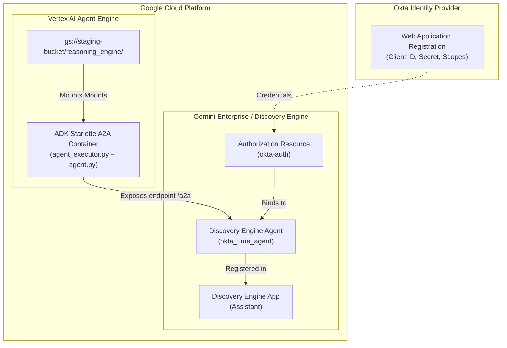

# Cloud Deployment & Surfacing Plan: Okta A2A Agent on Agent Engine

This operational blueprint analyzes the exact infrastructure steps, configuration requirements, and IAM permissions needed to deploy your Okta-protected A2A Agent on **Vertex AI Agent Engine (Reasoning Engine)** and surface it within a **Gemini Enterprise (Discovery Engine)** application.

---

## 🏗️ Architecture of the Hosted Enterprise Stack



---

## 1. Infrastructure Prerequisites & IAM Setup

To deploy and surface the agent, the deploying user or CI/CD service account must possess the following minimum Google Cloud IAM roles:

### A. Deployer IAM Roles
*   **Vertex AI Administrator** (`roles/aiplatform.admin`): Required to create and manage the Reasoning Engine.
*   **Storage Object Creator & Viewer** (`roles/storage.objectAdmin`): Required to upload pickled agent assets to the staging GCS bucket.
*   **Discovery Engine Admin** (`roles/discoveryengine.admin`): Required to create the Authorization Resource and register the Agent inside your Gemini Enterprise App.

### B. Staging GCS Bucket
Create a GCS bucket dedicated to staging Reasoning Engine assets:
```bash
gcloud storage buckets create gs://<YOUR-STAGING-BUCKET> --location=us-central1
```

---

## 2. Phase 1: Creating the Okta Authorization Resource in Discovery Engine

Before the agent is registered, Gemini Enterprise must be configured with the credentials needed to execute the OAuth handshake with Okta.

### A. Okta Redirect Whitelist
Log into your Okta Developer Console, navigate to your Web Application integration, and add the standard Gemini Enterprise redirect endpoints to your **Sign-in redirect URIs** list:
1.  `https://vertexaisearch.cloud.google.com/oauth-redirect`
2.  `https://vertexaisearch.cloud.google.com/static/oauth/oauth.html`

### B. Construct the OAuth 2.0 Handshake URI
The `authorizationUri` tells Gemini Enterprise how to request authorization codes from Okta. Use the following pattern (replacing `<OKTA_DOMAIN>` and `<CLIENT_ID>`):
```text
https://<OKTA_DOMAIN>/oauth2/default/v1/authorize?client_id=<CLIENT_ID>&redirect_uri=https%3A%2F%2Fvertexaisearch.cloud.google.com%2Fstatic%2Foauth%2Foauth.html&scope=openid+offline_access+agent%3Atime&response_type=code&access_type=offline&prompt=consent
```

### C. Create the Resource via cURL
Submit a POST request to the global Discovery Engine authorizations API:

```bash
curl -X POST \
   -H "Authorization: Bearer $(gcloud auth application-default print-access-token)" \
   -H "Content-Type: application/json" \
   -H "X-Goog-User-Project: <PROJECT_ID>" \
   "https://global-discoveryengine.googleapis.com/v1alpha/projects/<PROJECT_ID>/locations/global/authorizations?authorizationId=okta-auth" \
   -d '{
      "name": "projects/<PROJECT_ID>/locations/global/authorizations/okta-auth",
      "serverSideOauth2": {
         "clientId": "<YOUR_OKTA_CLIENT_ID>",
         "clientSecret": "<YOUR_OKTA_CLIENT_SECRET>",
         "authorizationUri": "https://<YOUR_OKTA_DOMAIN>/oauth2/default/v1/authorize?client_id=<YOUR_OKTA_CLIENT_ID>&redirect_uri=https%3A%2F%2Fvertexaisearch.cloud.google.com%2Fstatic%2Foauth%2Foauth.html&scope=openid+offline_access+agent%3Atime&response_type=code&access_type=offline&prompt=consent",
         "tokenUri": "https://<YOUR_OKTA_DOMAIN>/oauth2/default/v1/token"
      }
   }'
```

---

## 3. Phase 2: Deploying the Agent to Vertex AI Agent Engine

We have packaged this flow inside [`deploy_ae.py`](file:///Users/laah/Code/A2AOcta/deploy_ae.py). 

### A. Configure Environment
Create a `.env` file in your workspace root:
```ini
PROJECT_ID="your-gcp-project-id"
LOCATION="us-central1"
STORAGE_BUCKET="gs://your-gcs-staging-bucket"
```

### B. Execution
Run the deployment script:
```bash
python3 deploy_ae.py
```

### C. Behind the Scenes (Agent Engine Lifecycle)
1.  **Pickle & Bundle**: The Vertex SDK serializes your `OktaTimeAgent` instance into a `pickle.pkl` file, bundles `agent.py`, `agent_executor.py`, and `a2ui_schema.py` into `dependencies.tar.gz`, and uploads them to your GCS staging bucket.
2.  **Container Startup**: The managed platform provisions a Docker container running the Starlette A2A server and mounts your pickled agent and dependencies.
3.  **Exposing A2A**: The A2A server exposes the standard A2A endpoints (such as `/a2a/v1/card` and `/a2a/v1/message:send`) on port `8080`.
4.  **Endpoint Resolution**: The SDK returns a hosted resource path:
    ```text
    projects/<PROJECT_NUMBER>/locations/us-central1/reasoningEngines/<ENGINE_ID>
    ```

---

## 4. Phase 3: Surfacing on the Gemini Enterprise Application

To make your agent accessible inside your Gemini Enterprise search or chat application (Discovery Engine App), it must be registered as a **Discovery Engine Agent**.

Our [`deploy_ae.py`](file:///Users/laah/Code/A2AOcta/deploy_ae.py) script handles this automatically if `GEMINI_ENTERPRISE_APP_ID` and `AGENT_AUTHORIZATION` are set in your `.env`.

### A. Fetch the Deployed Agent Card
Gemini Enterprise needs to know the capabilities and tools of your agent. The deployment script fetches this directly from your Reasoning Engine's public card endpoint:
```python
a2a_endpoint = f"https://{location}-aiplatform.googleapis.com/v1beta1/{remote_engine_resource}/a2a/v1/card"
headers = {"Authorization": f"Bearer {token}"}
response = requests.get(a2a_endpoint, headers=headers)
a2ui_agent_card = response.json()
```

### B. Register with Gemini Enterprise
The script registers the agent under your target Gemini Enterprise App (Engine ID) using the Discovery Engine Assistants API:

*   **Target API Endpoint**:
    ```text
    POST https://discoveryengine.googleapis.com/v1alpha/projects/{PROJECT_ID}/locations/global/collections/default_collection/engines/{GEMINI_ENTERPRISE_APP_ID}/assistants/default_assistant/agents
    ```
*   **JSON Request Payload**:
    ```json
    {
        "name": "okta_time_agent",
        "displayName": "Okta A2A Time Agent",
        "description": "Time agent authenticated via Okta managed OAuth flow.",
        "a2aAgentDefinition": {
            "jsonAgentCard": "<STRINGIFIED_A2UI_AGENT_CARD>"
        },
        "authorizationConfig": {
            "agentAuthorization": "projects/<PROJECT_NUMBER>/locations/global/authorizations/okta-auth"
        }
    }
    ```

### C. Final Verification
Once registered, the agent will appear as a toggleable tool or active assistant in your **Gemini Enterprise App Console**.

1.  **User Prompt**: A user in the Gemini App inputs: *"What time is it in Tokyo?"*
2.  **OAuth Redirect Trigger**: Because the agent is bound to the `okta-auth` Authorization Resource, the Gemini gateway checks if the user is authenticated. If not, it displays an interactive card: **"Please sign in to Okta Time Agent to continue."**
3.  **Authorization Code Flow**: Clicking the card redirects the user to your Okta organization sign-in page. On successful login, Okta returns the authorization code, which Gemini exchanges silently for the Access Token and Refresh Token.
4.  **Secure Token Delivery**: Gemini forwards the query to your hosted Agent Engine container, appending the token under:
    ```text
    Authorization: Bearer <Okta_Access_Token>
    ```
5.  **Tool Processing**: The `AdkAgentToA2AExecutor` extracts this token, persists it in `session.state`, and the `get_current_time` tool processes it successfully!
