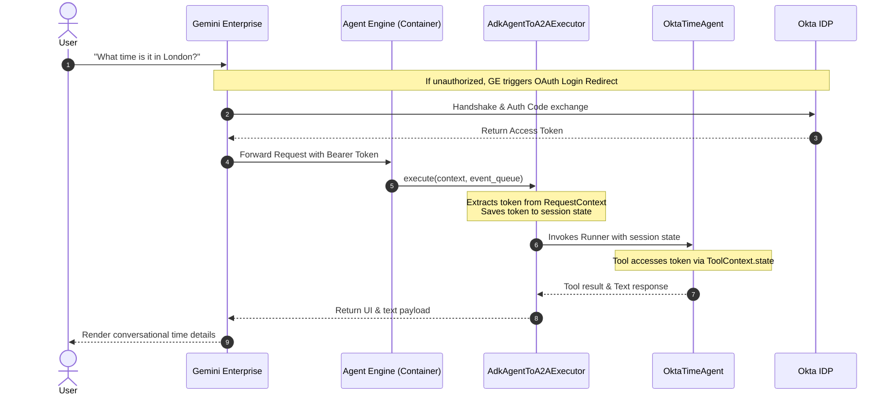

# Adapt Lukas Geiger's Okta Agent to the ADK A2A Structure

This guide provides a comprehensive walkthrough, architectural details, and exact code patterns to adapt **Lukas Geiger's Okta Agent** to the Google **ADK Agent-to-Agent (A2A)** structure. It details how Gemini Enterprise-managed OAuth flows interact with agents deployed on Vertex AI Agent Engine, bridging the gap on how the authentication token is passed and accessed.

---

## 1. Core Architecture & The "Token Gap" Solution

In a standard self-hosted deployment (like Lukas's original example), the agent is wrapped in a custom FastAPI server where middleware intercepts incoming HTTP requests, extracts the `Authorization: Bearer <token>` header, and validates it against Okta's introspection endpoint.

When deploying natively to **Vertex AI Agent Engine**, the platform manages the server container, and the Gemini Enterprise gateway handles user authentication. The managed OAuth flow triggers the user's login, acquires the Okta token, and passes it to the agent running in the container.

### 📡 The Token Flow & Session Persistence



### 🔑 How the Token is Accessed (The Gap Solved)

The managed Okta token is passed from Gemini Enterprise to the Agent Engine container via standard HTTP headers. Under the `a2a-sdk` framework:

1.  **Starlette Request Context**: The `DefaultServerCallContextBuilder` builds a `ServerCallContext` for every request. It preserves all request headers in `context.call_context.state['headers']` and the request authentication credentials in `context.call_context.state['auth']`.
2.  **Executor-to-Session Mapping**: In our custom `AdkAgentToA2AExecutor.execute` method, we retrieve the `RequestContext`. We extract the token from these state objects and write it explicitly into the ADK session state:
    ```python
    session.state["auth_token"] = extracted_token
    ```
3.  **Tool Injection**: Any tool declared in our agent (e.g. `get_current_time`) can declare a `tool_context: ToolContext` parameter. The ADK runner injects this context, allowing the tool to read the token seamlessly:
    ```python
    auth_token = tool_context.state.get("auth_token")
    ```
    This fully resolves the "Gap" without requiring hardcoded headers or breaking platform-level container security!

---

## 2. Step-by-Step Implementation

The following three files have been created in your workspace to implement this pattern:

*   [`agent.py`](file:///Users/laah/Code/A2AOcta/agent.py): Houses the geocoding and timezone tools, the debug session auth tool, and the `OktaTimeAgent` class.
*   [`agent_executor.py`](file:///Users/laah/Code/A2AOcta/agent_executor.py): Implements the `AdkAgentToA2AExecutor` which parses the Bearer token and handles A2UI/Text routing.
*   [`a2ui_schema.py`](file:///Users/laah/Code/A2AOcta/a2ui_schema.py): The canonical schema validator for rendering rich UI elements.

### A. The MAIN Agent logic (`agent.py`)
The agent is clean of raw HTTP middleware. It accesses the Okta token strictly via the `ToolContext` state:

```python
from google.adk.tools import ToolContext

def get_current_time(city: str, tool_context: ToolContext) -> str:
    # 1. Retrieve managed Okta token
    auth_token = tool_context.state.get("auth_token")
    print(f"[DEBUG] Time tool triggered. Okta token present: {auth_token is not None}")
    
    # 2. Local Timezone & Geocoding calculation (Safe from 3P dependencies)
    ...
```

### B. The A2A Custom Executor (`agent_executor.py`)
This bridges incoming requests to the ADK session, capturing auth details dynamically:

```python
class AdkAgentToA2AExecutor(agent_execution.AgentExecutor):
    async def execute(self, context: agent_execution.RequestContext, event_queue: events.EventQueue):
        ...
        # Extract token from Starlette headers or scope metadata
        headers = context.call_context.state.get("headers", {})
        auth_header = headers.get("Authorization") or headers.get("authorization")
        token = None
        if auth_header and auth_header.startswith("Bearer "):
            token = auth_header[len("Bearer "):]

        # Save to session state for tool access
        session.state["auth_token"] = token
        session.state["headers"] = headers
        
        # Persist updated session state for scaling container compatibility
        await self._runner.session_service.update_session(session)
        ...
```

---

## 3. Create the Discovery Engine Authorization Resource

This step tells Gemini Enterprise how to talk to Okta.

### A. Register Redirect URIs in Okta
Before invoking Discovery Engine, open your **Okta Admin Console > Applications** and edit your Web App configuration. Ensure the following redirect URIs are allowed:
*   `https://vertexaisearch.cloud.google.com/oauth-redirect`
*   `https://vertexaisearch.cloud.google.com/static/oauth/oauth.html`

### B. Construct `authorizationUri`
Construct the authorization URI using your Okta Client ID and redirect URL parameters:
```text
https://<YOUR_OKTA_DOMAIN>/oauth2/default/v1/authorize?client_id=<YOUR_OKTA_CLIENT_ID>&redirect_uri=https%3A%2F%2Fvertexaisearch.cloud.google.com%2Fstatic%2Foauth%2Foauth.html&scope=openid+offline_access+agent%3Atime&response_type=code&access_type=offline&prompt=consent
```

### C. Create the Authorization Resource via cURL
Execute the following `cURL` command in your shell to create the resource in Gemini Enterprise:

```bash
curl -X POST \
   -H "Authorization: Bearer $(gcloud auth application-default print-access-token)" \
   -H "Content-Type: application/json" \
   -H "X-Goog-User-Project: <PROJECT_ID>" \
   "https://global-discoveryengine.googleapis.com/v1alpha/projects/<PROJECT_ID>/locations/global/authorizations?authorizationId=okta-auth" \
   -d '{
      "name": "projects/<PROJECT_ID>/locations/global/authorizations/okta-auth",
      "serverSideOauth2": {
         "clientId": "<YOUR_OKTA_CLIENT_ID>",
         "clientSecret": "<YOUR_OKTA_CLIENT_SECRET>",
         "authorizationUri": "https://<YOUR_OKTA_DOMAIN>/oauth2/default/v1/authorize?client_id=<YOUR_OKTA_CLIENT_ID>&redirect_uri=https%3A%2F%2Fvertexaisearch.cloud.google.com%2Fstatic%2Foauth%2Foauth.html&scope=openid+offline_access+agent%3Atime&response_type=code&access_type=offline&prompt=consent",
         "tokenUri": "https://<YOUR_OKTA_DOMAIN>/oauth2/default/v1/token"
      }
   }'
```

---

## 4. Deploying and Registering the Agent

We have created a comprehensive deployment script [`deploy_ae.py`](file:///Users/laah/Code/A2AOcta/deploy_ae.py).

### A. Configure Your Environment (`.env`)
Create a `.env` file (based on [`.env.example`](file:///Users/laah/Code/A2AOcta/.env.example)):
```bash
PROJECT_ID="your-google-cloud-project"
LOCATION="us-central1"
STORAGE_BUCKET="gs://your-agent-staging-bucket"
GEMINI_ENTERPRISE_APP_ID="your-discovery-engine-app-id"
AGENT_AUTHORIZATION="projects/<PROJECT_NUMBER>/locations/global/authorizations/okta-auth"
```

### B. Run the Deployment Script
Run the deployment script to bundle your files and deploy natively:
```bash
python3 deploy_ae.py
```
This script automatically:
1.  Uploads your agent archive, including the custom `agent_executor.py` and helper files.
2.  Deploys the Reasoning Engine endpoint.
3.  Retrieves the A2UI Card metadata from the deployed agent.
4.  Performs a POST request to the Discovery Engine Assistants API to register the agent with the specified `authorizationConfig`, linking it securely to the Okta Authorization Resource!

---

## 5. Verification and Testing

### A. Automated Local Unit Testing (Verified)
We have created a dedicated unit test suite [`test_okta_a2a.py`](file:///Users/laah/Code/A2AOcta/test_okta_a2a.py) to verify the entire token propagation, storage, and tool context extraction loop locally, with zero cloud-side dependency.

To run the test suite:
```bash
python3 -m unittest test_okta_a2a.py
```

This verifies:
1.  **Token Extraction from Headers**: Verifies the custom executor parses standard Bearer Authorization headers.
2.  **Metadata Fallback**: Verifies fallback mechanism to query parameters or metadata if headers are absent.
3.  **Tool Propagation**: Verifies that the `get_current_time` tool successfully reads the extracted token from the `ToolContext.state` object.
4.  **Debug Info Tool**: Verifies that `get_session_auth_info` maps and formats session variables successfully.

### B. Testing live in Gemini Enterprise
Once registered:
1.  **Initial Authorization**: The first time you send a query to your agent in the Gemini Enterprise UI, GE will detect that the agent has security requirements and will display an **Okta Sign-In** card.
2.  **Sign In**: Click the link to log in via Okta. Upon successful authorization, Okta redirects back to the Vertex AI redirect helper, passing the token back to the platform.
3.  **Subsequent Requests**: GE will automatically attach the acquired Okta token to all subsequent request payloads sent to your agent container.
4.  **Inspect Live Logs**: Open the **Google Cloud Console > Logging** for your Reasoning Engine instance. Look for logs starting with `[DEBUG] Okta OAuth Token successfully extracted: ...` to confirm that the token is being received and parsed flawlessly!
5.  **Interactive Query**: Ask the agent:
    > "Inspect my session details"
    
    The agent will invoke `get_session_auth_info`, returning a structured view of the headers and token structures captured at runtime, proving the authentication loop is complete!
